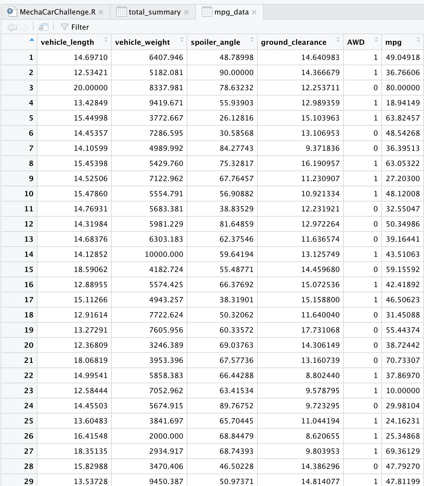
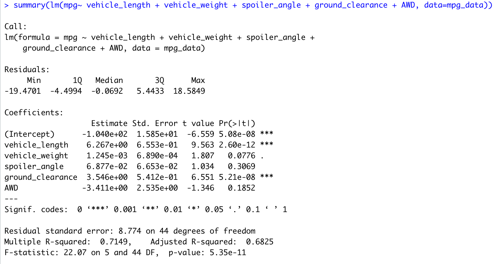
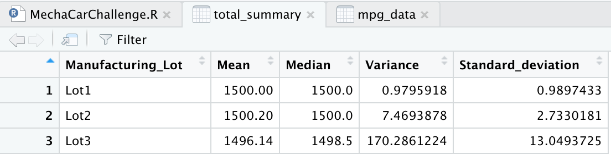
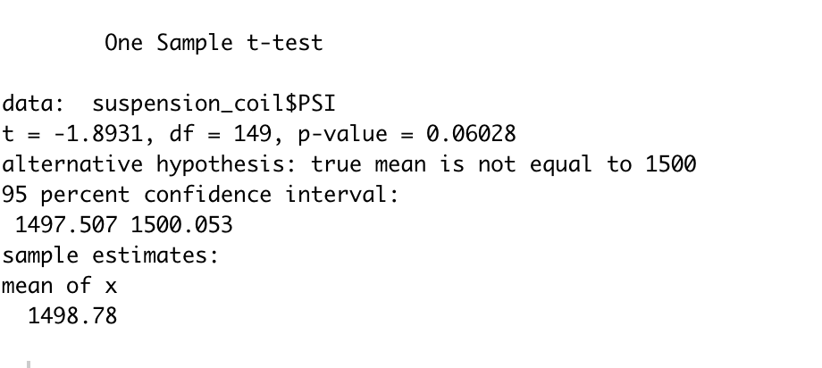

# MechaCar_Statistical_Analysis
This was a statistical analysis ran on protype cars and compare different aspects of them.

##Linear Regression to Predict MPG

-Which variables/coefficients provided a non-random amount of variance to the mpg values in the dataset? Vechicle weight had a significance value over .05 
-Is the slope of the linear model considered to be zero? Why or why not? No the slope of the linear model isn't zero since the r^2 is .6825
-Does this linear model predict mpg of MechaCar prototypes effectively? Why or why not?
This model would need more data points since the test was ran on only 50 data points. This was too small of a model to predict effectively.

##Summary Statistics on Suspension Coils

#T-Test on suspension coil

